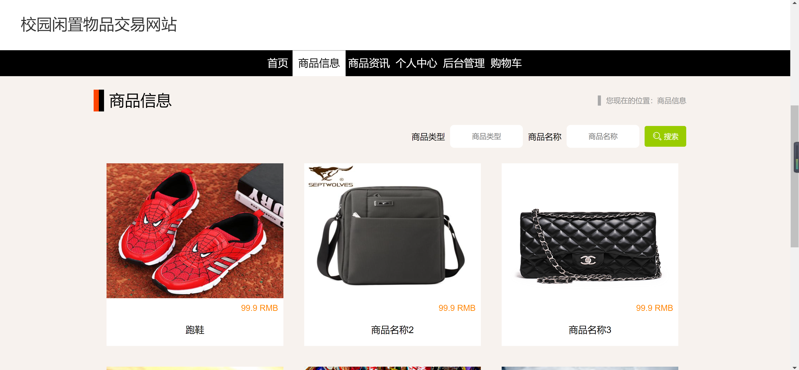
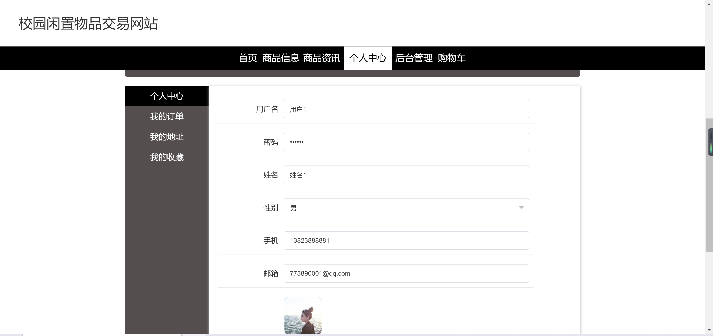
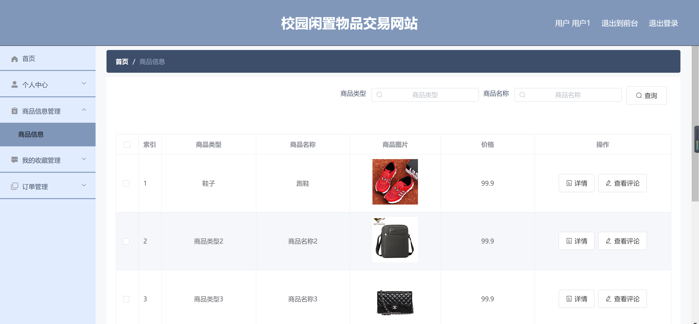
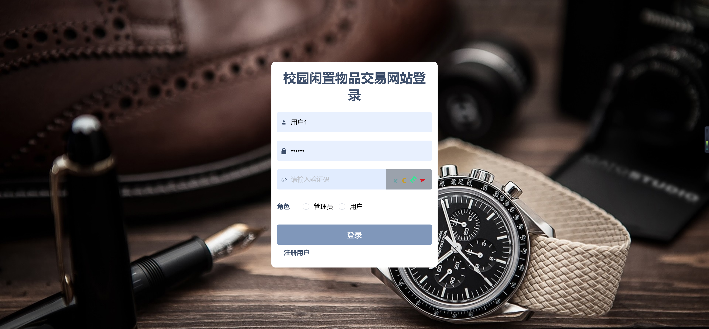
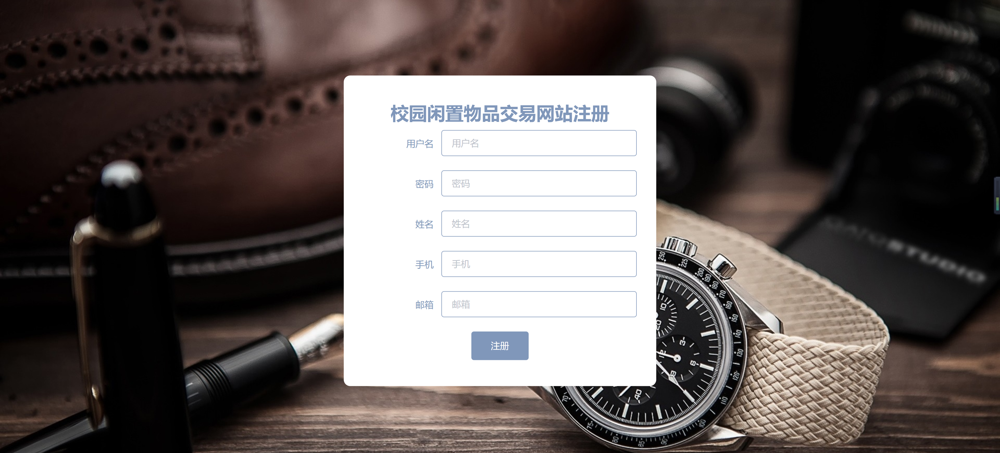
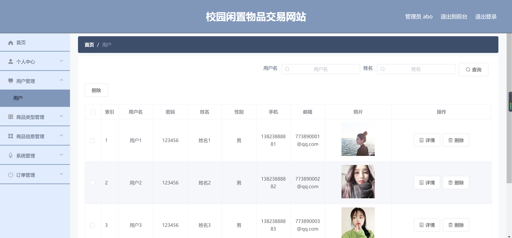

<h1 align="center">校园闲置物品交易系统</h1>

## 简介
校园闲置物品交易系统：角色分为管理员、用户；功能包括商品信息管理、用户管理、订单管理、购物和注册登录，支持商品发布与查询，界面设计简洁直观便于操作。    --计算机毕业设计源码；毕设源码；java毕业设计源码

## 联系方式

<h3 align="center">获取完整代码与数据库文件 + 微信：deepguan QQ: 86050149 QQ群: 783742310</h3>

<h3 align="center">可帮忙远程部署 包运行成功！提供远程部署、修改代码、设计文档指导、代码讲解等服务！</h3>

## 功能介绍（完整见运行截图）
管理员：管理员可以通过登录界面选择身份角色进行身份验证，访问系统的后台管理功能，包括用户管理、商品类型管理、商品信息管理、系统管理和订单管理等。管理员能够查看和编辑用户信息，管理商品信息和订单，确保系统的正常运行和维护。

用户：用户可以通过注册页面创建账户，登录后访问个人中心，查看和修改个人信息，包括用户名、密码、姓名、性别、手机号及邮箱等。用户可以浏览商品信息，使用搜索功能查找特定商品，查看商品详情和评论，添加商品到购物车，并进行订单管理和收藏管理。

## 运行截图

本代码来源于网络,仅供学习参考使用!

